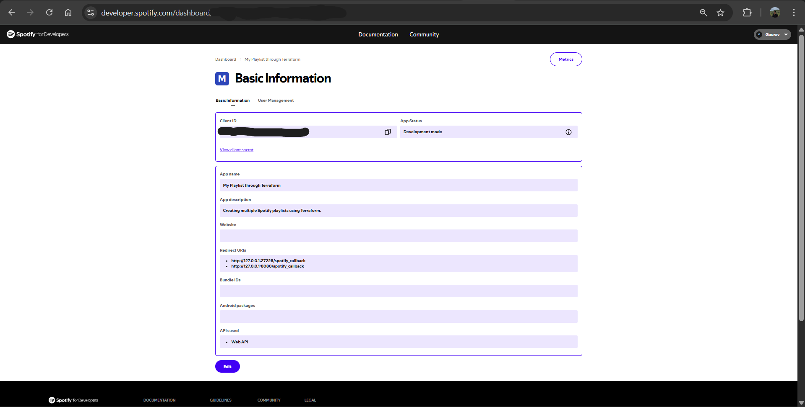
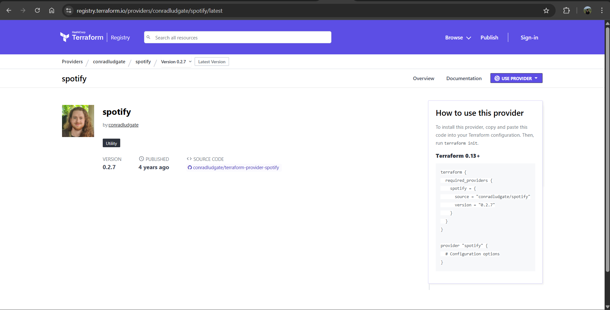
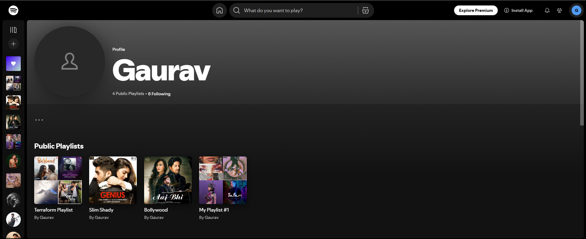

# Spotify Playlist Management with Terraform

> ⚠️ **IMPORTANT NOTICE**: This project currently **WILL NOT WORK** due to Spotify's updated redirect URI requirements. According to the [Spotify Web API documentation](https://developer.spotify.com/documentation/web-api/concepts/redirect_uri), `localhost` is no longer allowed as a redirect URI. Spotify now requires:
>
> - HTTPS for redirect URIs (except for loopback addresses)
> - Explicit IPv4 or IPv6 loopback addresses like `http://127.0.0.1:PORT` or `http://[::1]:PORT`
> - `localhost` is explicitly **not allowed**
>
> This project was designed for local development but cannot function under the current Spotify API restrictions. Consider using a hosted solution or HTTPS-enabled local development environment or new provider.

This project demonstrates how to manage Spotify playlists and tracks using Terraform with the Spotify provider. It creates multiple playlists with tracks from various artists.

## 🎵 What This Project Does

- Creates Spotify playlists automatically using Terraform
- Searches for tracks by specific artists
- Manages playlist content through infrastructure as code
- Demonstrates Spotify API integration with Terraform

## 📋 Prerequisites

- [Terraform](https://www.terraform.io/downloads.html) installed
- [Docker](https://www.docker.com/products/docker-desktop/) installed and Docker Desktop running
- Spotify Developer Account
- Spotify API credentials (Client ID and Client Secret)

## 🚀 Setup Guide

### 1. Spotify Developer Account Setup

First, you'll need to set up a Spotify Developer account to get API credentials:



1. Go to [Spotify Developer Dashboard](https://developer.spotify.com/dashboard)
2. Log in with your Spotify account
3. Create a new application
4. Note down your Client ID and Client Secret

### 2. Terraform Provider Configuration

This project uses the Spotify Terraform provider to manage your playlists:



The provider configuration is set up in `provider.tf` and uses the Spotify API to create and manage playlists.

### 3. Run the Spotify Auth App and Get the API Key

Make sure Docker Desktop is running, and start the authorization proxy server:

```bash
docker run --rm -it -p 27228:27228 --env-file .env ghcr.io/conradludgate/spotify-auth-proxy
```

This will start the Spotify authorization proxy that will help you obtain the API key needed for the Terraform provider.

### 4. Configuration

1. **Edit `terraform.tfvars` and `.env` with your credentials**

2. **Initialize Terraform:**

   ```bash
   terraform init
   ```

3. **Plan and Apply:**
   ```bash
   terraform plan
   terraform apply
   ```

## 🎶 Playlists Created

This project creates the following playlists:

- **Bollywood** - Contains Bollywood tracks
- **Slim Shady** - Features tracks from Arijit Singh
- **Terraform Playlist** - Mixed playlist with tracks from multiple artists:
  - Arijit Singh
  - Jubin Nautiyal
  - Neha Kakkar
  - Zayn Malik

## 📸 Results

After running the Terraform configuration, you'll see your playlists created in your Spotify account:



## 🛠️ Usage

### Adding New Playlists

To add a new playlist, edit `playlist.tf`:

```hcl
resource "spotify_playlist" "new_playlist" {
    name = "My New Playlist"
    tracks = ["track_id_1", "track_id_2"]
}
```

### Searching for Tracks

To search for tracks by artist:

```hcl
data "spotify_search_track" "artist_name" {
    artist = "Artist Name"
}
```

## 📚 Resources

- [Spotify Web API Documentation](https://developer.spotify.com/documentation/web-api/)
- [Terraform Spotify Provider](https://registry.terraform.io/providers/conradludgate/spotify/latest/docs)
- [Terraform Documentation](https://www.terraform.io/docs)
